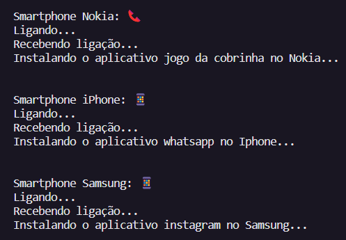

# Sistema de Cadastro de smartphones com POO em C# 📱

Projeto em C# que implementa um Sistema de cadastro de Smartphones seguindo os principios de programação orientada a objetos.

## Contexto ☎️

Você é responsável por modelar um sistema que trabalha com celulares. Para isso, foi solicitado que você faça uma abstração de um celular e disponibilize maneiras de diferentes marcas e modelos terem seu próprio comportamento, possibilitando um maior reuso de código e usando a orientação a objetos.

## Proposta 📲

Você precisa criar um sistema em .NET, do tipo console, mapeando uma classe abstrata e classes específicas para dois tipos de celulares: Nokia e iPhone.
Você deve criar as suas classes de acordo com o diagrama abaixo:

## Regras e validações 📵

1. A classe **Smartphone** deve ser abstrata, não permitindo instanciar e servindo apenas como modelo.
2. A classe **Nokia** e **Iphone** devem ser classes filhas de Smartphone.
3. O método **InstalarAplicativo** deve ser sobrescrito na classe Nokia e iPhone, pois ambos possuem diferentes maneiras de instalar um aplicativo.

## Resultado 📱

Após instanciar as classes na main do projeto (Program.cs), foram realizados os testes com os métodos concretos e abstratos. Sendo representados no terminal da seguinte forma:

